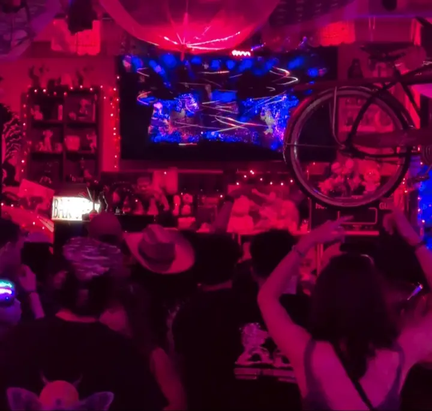

# Blurred Lines VFX

Live depth-camera visuals for performances. Works with either a **ZED** stereo camera or a **Kinect V2**.

## Requirements

- Unity 6000.3 LTS with HDRP 17.3
- **ZED:** ZED SDK 5.5.0 installed. The `com.stereolabs.zed` package is pinned to `v5.5.0` and must match the installed SDK.
- **Kinect V2:** the Kinect for Windows Runtime 2.0. The managed wrappers and the 64-bit add-in are included in `Assets/Standard Assets` and `Assets/Plugins/x86_64`.

## Usage

1. Open `Assets/Scenes/blurred-lines-vfx.unity`.
2. Select **Director** and choose **ZED** or **Kinect** in the **Source** dropdown of the Depth Camera Selector.
3. Connect that camera and press Play.

While playing, the arrow keys and mouse scroll adjust focus distance and the near/far clipping planes. With the ZED, press **R** to reload the scene if the camera stops responding.

## Credits

The visuals are derived from the work of **[Keijiro Takahashi](https://github.com/keijiro)**, whose depth-camera VFX Graph experiments these effects are built on:

- [Rsvfx](https://github.com/keijiro/Rsvfx): connecting a depth camera's point cloud to VFX Graph through position and color maps, the approach this whole project uses
- [Akvfx](https://github.com/keijiro/Akvfx): the `WebUV` operator used by the line effect
- [VfxGraphAssets](https://github.com/keijiro/VfxGraphAssets): the depth-of-field block used by the depth particle effect
- His Unity packages used at runtime: VFX Graph Assets, Shader Graph Assets, Noise Shader, Klak Motion, Klak Timeline Procedural Motion and Pcx

This project is built on **[Roel Kok](https://github.com/roelkok)'s [Kinect-VFX-Graph](https://github.com/roelkok/Kinect-VFX-Graph)**, which it was forked from and whose commit history it keeps. His project supplied the Kinect V2 side.
